# vimstone

An unassuming Neovim distribution used by Flipstone and friends

## Installation

* Make sure you have Neovim (`nvim`) installed.
  * Vimstone currently targets v0.7.2 of Neovim
* Make sure you have Ripgrep (`rg`) installed

* Clone the repo: `git clone git@github.com:flipstone/vimstone.git ~/.config/nvim`
* Run `nvim`
  * Answer `y` (or just hit enter) when it asks if you want to install plugins

## Upgrading

See `:Tutor vimstone-upgrading`

## Learning the ropes

### Mappings

vimstone includes the `which-key` plugin, which makes mappings more
discoverable.  All the custom vimstone mappings use the the space key as the
leader. If you hit space without any other characters a menu will appear
showing you what possible characters after space might lead to a mapping. If
you keep hitting characters in the map submenus will be present until you get
to a mapping with a command attached.

### Tutor

`:Tutor` is your friend! Run it to get a very basic introduction to vim.
There's also a tutorial for Vimstone itself: `:Tutor vimstone`! It will help
you get familiar with the specific plugin.

### Tree-sitter

#### Incremental select
You can select surrounding code using `<control-space>`.

For example, with this initial cursor position in normal mode:

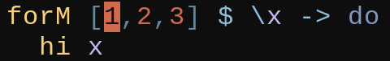

The first key press will enter visual mode. A subsequent press will get you the following selection:

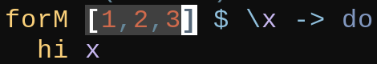

and after the next key press:

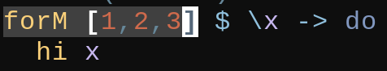

#### Text-objects

| Text object | Start state      | Input | End state (outer variant) | Input | End state (inner variant) |
| ----------- | ---------------- | ----- | ------------------------- | ----- | ------------------------- |
| Parameter   |  | `caa` |           | `cia` | 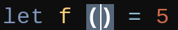          |
| Function    | 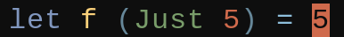 | `caf` | 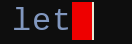          | `cif` | 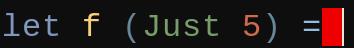          |
| Class       | 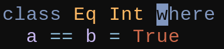 | `cac` |           | `cic` | 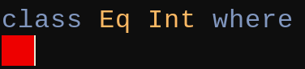          |
| Comment     |  | `cao` | 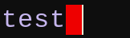          | N/A   | N/A                       |
| Loop        | 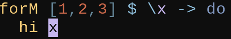 | `cal` |           | `cil` |           |
